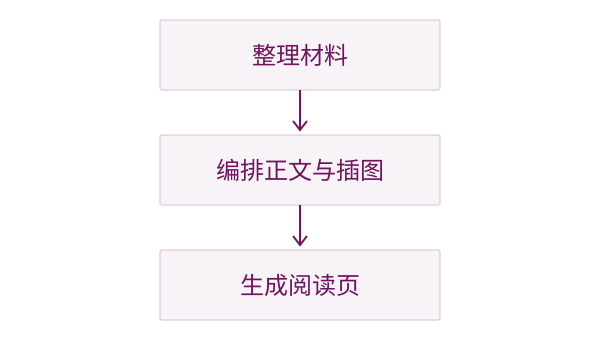

# 从演示到阅读

## 给要点补上解释

### 一页讲清一个问题



演示时，屏幕上的一句话往往依靠讲述者补全含义。阅读材料需要把这部分解释写出来：问题是什么，为什么这样设计，一个具体例子怎样说明结论。

**以读者要理解的问题划分页。** 同一主题下的多张 slides 可以整理为一个 section，而不必保留原来的逐页边界。长内容允许滚动，读者可以停下来、回看，也可以放大图片查看细节。

### 让插图参与解释

图应当出现在相关段落旁边，并配上说明。与正文相同，图片需要表达清楚的意思：它展示了哪些关系，应该先看哪里，又支持了哪个结论。引自其他材料时，在图注中保留来源。

## 编排与分享

### 正文是一份可编辑的源稿

用 Markdown 保存标题、正文和图片引用。修改内容后重新编译，即可得到新的阅读版本。主题文件可以单独调整配色、字体和间距，内容无需跟着重写。

```bash
folio bind pages.md
folio bind pages.md --theme theme.json -o reading.html
```

### 阅读不需要安装工具

生成的 HTML 包含正文、插图和播放器，可以直接在浏览器中打开。左右键切换页面，滚轮阅读长页，点击插图放大。将这个文件发送给读者，就能开始阅读。
